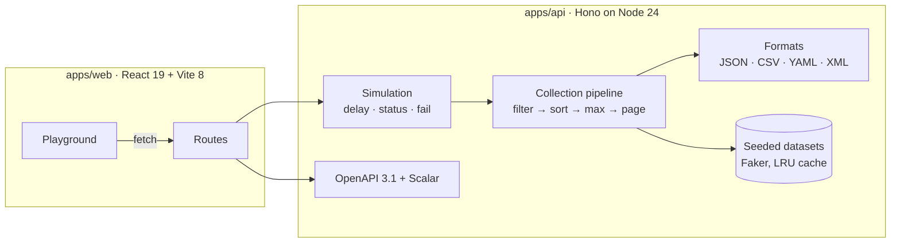

# REST in Pieces

[](https://github.com/spxis/rest-in-pieces/actions/workflows/ci.yml)


[](LICENSE)

**A repeatable test backend for frontend development.** Build tables, pagination, sorting, filters, loading states, empty states and error handling against realistic data, before a real backend exists.

Every dataset is generated from a seed. The same URL returns the same records on every machine and after every restart, so a bug can be reproduced from its URL instead of disappearing with a new random dataset.


## Why use it

- **Repeatable data.** `?seed=42` always returns the same records. Screenshots, snapshot tests and bug reports stay stable.
- **Realistic collections.** People, users, products, companies and countries, plus any shape you describe with 237 generator types.
- **Japanese data too.** `?locale=ja` switches every dataset to data written for a Japanese audience: kanji names with katakana readings, real prefectures and cities, 〒 postal codes, mobile numbers, yen prices and Japanese country names.
- **Everything a list screen needs.** Paging, sorting, field filters with ranges, free-text search, `X-Total-Count` and `Link` headers, and ETags.
- **The unhappy path on demand.** `?delay=1500`, `?status=503` or `?fail=0.2` rehearse slow, failing and flaky backends without touching your client.
- **Any format.** JSON, CSV, YAML or XML, chosen by `?format=` or the `Accept` header.
- **Self-documenting.** An OpenAPI 3.1 spec generated from the same schemas that validate requests, with interactive docs at `/docs`.
- **A playground.** Build a request, inspect the table, body and headers, page through results, and share the exact setup as a link.

## Quick start

Requires Node.js 22.18 or later (24 LTS recommended) and pnpm.

```sh
pnpm install
pnpm dev
```

| Service    | URL                                                  |
| ---------- | ---------------------------------------------------- |
| API        | [http://localhost:8080](http://localhost:8080)       |
| API docs   | [http://localhost:8080/docs](http://localhost:8080/docs) |
| Playground | [http://localhost:5173](http://localhost:5173)       |

Or run everything from one container:

```sh
docker build -t rest-in-pieces .
docker run --rm -p 8080:8080 rest-in-pieces   # playground, API and docs on :8080
```

## Using the API

```sh
# First page of people, in the original envelope
curl 'http://localhost:8080/names?limit=10'

# Women in their thirties in Ontario, oldest first
curl 'http://localhost:8080/names?gender=female&age[gte]=30&age[lt]=40&province=Ontario&sortBy=age:numeric&sortDirection=desc'

# One record
curl 'http://localhost:8080/users/42?seed=7'

# Books under $100 as CSV
curl 'http://localhost:8080/products?department=Books&price[lt]=100&format=csv'

# The same people, for a Japanese audience
curl 'http://localhost:8080/names?locale=ja&province=東京都&limit=5'

# Your own shape
curl 'http://localhost:8080/generate?fields=name:person.fullName,email:internet.email,plan:commerce.productAdjective&seed=3'
curl -X POST 'http://localhost:8080/generate?limit=5' \
  -H 'Content-Type: application/json' \
  -d '{ "fields": { "sku": "string.uuid", "price": "commerce.price" }, "count": 200, "seed": 9 }'

# A flaky backend: 30% of requests fail
curl -i 'http://localhost:8080/users?fail=0.3'
```

### Endpoints

| Endpoint                   | Description |
| -------------------------- | ----------- |
| `GET /names`               | Canadian people: name, age, address, city, province, postal code, gender. The original dataset, also at `/random-names`. |
| `GET /users`               | Application users with profile, avatar, contact details and account status. |
| `GET /products`            | Catalogue products with SKU, department, price, rating and stock. |
| `GET /companies`           | Companies with industry, website, size and founding year. |
| `GET /countries`           | Every country and territory with ISO codes, currencies, languages and calling codes. |
| `GET /{dataset}/{id}`      | One record: `/names/0`, `/users/1`, `/countries/CA` or `/countries/CAN`. |
| `GET /generate`            | Records from a field list, e.g. `fields=name:person.fullName,email:internet.email`. |
| `POST /generate`           | The same, with the fields, `count` and `seed` in a JSON body. |
| `GET /generators`          | Every generator type, flat and grouped by module. |
| `GET /resources`           | The datasets and their fields. |
| `GET /health`              | Status, version and uptime. |
| `GET /docs`, `/openapi.json` | Interactive reference and the OpenAPI 3.1 document. |

### Query parameters

These work on every collection, including `/generate`.

| Parameter       | Default   | Description |
| --------------- | --------- | ----------- |
| `limit`         | `10`      | Records per page, up to 1000. Aliases: `size`, `length`. |
| `offset`        | `0`       | Records to skip. |
| `max`           | `1000`    | Caps the dataset, to test the last page and end-of-data handling. Alias: `maxRecords`. |
| `sortBy`        | none      | Field to sort by. Append `:numeric` to compare as numbers, e.g. `age:numeric`. |
| `sortDirection` | `asc`     | `desc` (also `descending`, `reverse`, `rev`, `backwards`, `-1`). Alias: `sortOrder`. |
| `q`             | none      | Case-insensitive search across every field. |
| *field name*    | none      | Filters: `gender=female`, `province=Ontario,Quebec`, `age[gte]=30`. Operators: `eq`, `ne`, `gt`, `gte`, `lt`, `lte`. |
| `seed`          | `1`       | Selects a repeatable dataset. |
| `locale`        | `en-CA`   | `ja` for Japanese data. See [Japanese data](#japanese-data). |
| `metadata`      | on        | `false` returns the bare array. `/countries` defaults to off for compatibility. |
| `resultsName`   | `results` | Renames the results key, e.g. `rows`. |
| `format`        | `json`    | `csv`, `yaml` or `xml`. The `Accept` header works too. |
| `delay`         | `0`       | Milliseconds to wait before responding, up to 10000. |
| `status`        | none      | Respond with this status. 4xx and 5xx return a simulated error; 2xx and 3xx override the success status. |
| `fail`          | off       | `true` fails the request with a 500 (or `status`); a fraction such as `0.2` fails that share of requests. |

Simulated responses carry `X-Simulated: true`, and 429 and 503 carry `Retry-After`. Simulation never applies to `/health` or the docs.

### Response shape

```json
{
  "metadata": {
    "count": 10,
    "total": 1000,
    "timestamp": "1790618113511",
    "lastUpdated": "2026-09-28T17:55:13.511Z",
    "output": { "results": "results" },
    "version": "2.1.0",
    "parameters": { "size": 10, "offset": 0, "max": 1000, "seed": 1, "locale": "en-CA", "q": null, "sortBy": null, "sortType": "string", "sortDirection": "asc" },
    "links": { "self": "/names?limit=10&offset=0", "first": "…", "last": "…", "prev": null, "next": "/names?limit=10&offset=10" }
  },
  "results": [{ "index": 0, "name": "Aaliyah Corkery", "age": 26, "…": "…" }]
}
```

`total` counts the records after filters and `max`. The same numbers are in the `X-Total-Count` and `Link` headers, which are exposed to browsers through CORS.

## Japanese data

Add `locale=ja` to any dataset, item route or `/generate` call. Records keep the same shape and field names, so a client can switch locales without code changes. Japanese records add readings where Japanese forms ask for them.

| Dataset      | What changes with `locale=ja` |
| ------------ | ----------------------------- |
| `/names`     | Family name first (`佐藤 美穂`), plus `nameKana` (`サトウ ミホ`) and `nameRomaji` (`Sato Miho`). Prefectures and real cities, weighted by population, and `123-4567` postal codes. |
| `/users`     | Kanji names with `firstNameKana` and `lastNameKana`, romaji usernames and emails, mobile numbers (`090-1234-5678`) and Japanese job titles. |
| `/products`  | Japanese products and departments, priced in whole yen the way shops write them (`1980`, `2000`), with `currency: "JPY"`. |
| `/companies` | `株式会社` names, industries, slogans, romaji domains and real area codes such as `03` for Tokyo and `06` for Osaka. |
| `/countries` | Country names in Japanese (`カナダ`, `日本`) from the runtime's CLDR data. |
| `/generate`  | Every generator uses Faker's Japanese locale. |

Filters and search work on Japanese text: `/names?locale=ja&province=東京都`. Responses carry `Content-Language`, and `metadata.parameters.locale` records the choice. `gender` stays `male` or `female` in every locale so filters are portable.

### 日本語データ

任意のエンドポイントに `locale=ja` を付けると、日本向けのデータを返します。氏名は姓・名の順で、フリガナ（`nameKana`）とローマ字（`nameRomaji`）付きです。住所は実在の都道府県・市区町村を使用し、郵便番号は `123-4567` 形式、電話番号は `090-1234-5678` 形式、商品の価格は円単位（`1980` や `2000` など）です。同じ `seed` なら、いつでも同じデータが返ります。

```sh
curl 'http://localhost:8080/users?locale=ja&limit=5'
curl 'http://localhost:8080/products?locale=ja&sortBy=price:numeric&format=csv'
```

## Architecture



- **One pipeline.** Every collection, built-in or generated, goes through the same filter, sort, cap and page steps, so behaviour is identical everywhere.
- **Schemas first.** Routes are declared with Zod through `@hono/zod-openapi`; the OpenAPI document is generated from them and cannot drift from the code.
- **Deterministic by construction.** Datasets depend only on their seed, and the most recently used ones are cached in memory.
- **No build step for the API.** Node runs the TypeScript directly with type stripping.

```
apps/api     Hono API: routes, collection pipeline, datasets, OpenAPI
apps/web     React playground: components, hooks, request builder
tests/e2e    Playwright tests that drive the playground against the real API
```

## Development

| Script               | What it does |
| -------------------- | ------------ |
| `pnpm dev`           | API on :8080 and playground on :5173, both reloading |
| `pnpm check`         | Lint, typecheck, unit tests and build |
| `pnpm test`          | Unit and component tests (Vitest) |
| `pnpm test:coverage` | API tests with coverage thresholds |
| `pnpm test:e2e`      | Playwright end-to-end tests |
| `pnpm format`        | Apply formatting and safe lint fixes (Biome) |

Set `PORT` to move the API, and `VITE_API_BASE_URL` to point the playground elsewhere. See [CONTRIBUTING.md](CONTRIBUTING.md) for the full workflow.

## Deploying

**Vercel.** Create one project with **Root Directory** `apps/api`. `apps/api/vercel.json` builds the playground into `public/`, so the playground, API and docs share one origin with no extra configuration.

**Docker.** The image above serves everything from port 8080, runs as a non-root user and includes a health check.

## License

MIT © 2014–2026 SPX Interactive Software. Security issues: see [SECURITY.md](SECURITY.md).
