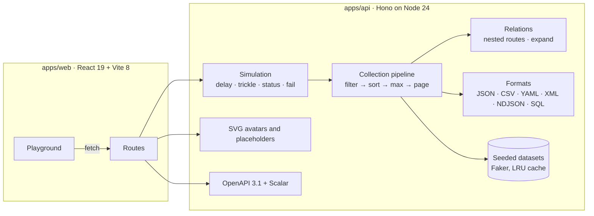

# REST in Pieces

[](https://github.com/spxis/rest-in-pieces/actions/workflows/ci.yml)
[](https://spxis.github.io/rest-in-pieces/)
[](https://www.npmjs.com/package/@johnmorrisdotca/rest-in-pieces)


[](https://github.com/spxis/rest-in-pieces/blob/main/LICENSE)

Seeded, realistic, localized data plus latency, error and messy-data drills, as a REST API, a function call or a patch on `fetch`.

A free, open-source **mock data generator and test data generator**: rule-based synthetic data (sample data, seed data and mock data for database seeding), and relational test data with **referential integrity** between users, products, orders, posts, comments, todos and reviews, **safe values** that cannot reach a real person, self-hosted **placeholder images** and **avatars**, and exports as JSON, CSV, YAML, XML, **NDJSON** and **SQL INSERT** statements. A **JSONPlaceholder alternative**, **DummyJSON alternative** and **Mockaroo alternative** that runs on your machine.

**Try it: [spxis.github.io/rest-in-pieces](https://spxis.github.io/rest-in-pieces/).** The live demo runs the whole API inside the page, so there is no server behind it and nothing to install.

**A repeatable test backend for frontend development.** Build tables, pagination, sorting, filters, loading states, empty states, error handling, CRUD forms and sign-in against realistic data, before a real backend exists.

It plugs into [Vite, MSW, Storybook, Next.js, Playwright, Cypress and openapi-fetch](#use-with), and answers any origin.

[](https://spxis.github.io/rest-in-pieces/)

Every dataset is generated from a seed. The same URL returns the same records on every machine and after every restart, so a bug can be reproduced from its URL instead of disappearing with a new random dataset.

## Run it

**With npx**, with nothing to clone (Node.js 22.13 or later):

```sh
npx @johnmorrisdotca/rest-in-pieces                  # API, playground and docs on http://localhost:6800
npx @johnmorrisdotca/rest-in-pieces --port 6900      # another port; PORT works too
npx @johnmorrisdotca/rest-in-pieces --host 0.0.0.0   # reachable from other machines and containers
npx @johnmorrisdotca/rest-in-pieces --session        # keep writes in memory until POST /reset
npx @johnmorrisdotca/rest-in-pieces --safe           # safe values by default: example-domain emails, fiction-range phones
```

**With Docker:**

```sh
docker run --rm -p 6800:6800 ghcr.io/spxis/rest-in-pieces
docker run --rm -p 6800:6800 -e REST_IN_PIECES_SESSION=true ghcr.io/spxis/rest-in-pieces   # keep writes
docker run --rm -p 6800:6800 -e REST_IN_PIECES_SAFE=true ghcr.io/spxis/rest-in-pieces      # safe values by default
```

**Inside your tests**, with no port and no server to start. `createApp()` builds the API and `app.request()` answers in-process, in Vitest, Jest, Playwright or any Node script:

```ts
import { createApp } from '@johnmorrisdotca/rest-in-pieces';
import { expect, test } from 'vitest';

test('lists five users', async () => {
  const res = await createApp().request('/users?limit=5&seed=42');
  expect(await res.json()).toHaveProperty('results.length', 5);
});
```

`@johnmorrisdotca/rest-in-pieces/core` exports `createApp` alone, with no Node imports, for workers and other fetch-style hosts.

`createApp({ session: true })` keeps writes, so a test can create, edit and delete and then read the result back; each app has a store of its own, so a fresh `createApp` is a fresh dataset. See [Sessions](#sessions-keeping-writes).

### A backend inside the tab

`@johnmorrisdotca/rest-in-pieces/browser` runs the API inside the page, so a frontend on StackBlitz, CodeSandbox or any static host gets a REST backend with no server:

```js
import { installInBrowserApi } from '@johnmorrisdotca/rest-in-pieces/browser';

installInBrowserApi(); // answers fetch('/api/...') in this tab; every other request goes to the network

const { results } = await (await fetch('/api/users?limit=10&seed=7')).json();
```

`installInBrowserApi({ base: '/mock' })` moves it, `installInBrowserApi({ app: { session: true } })` keeps writes for as long as the tab is open, and the function it returns puts the original `fetch` back. The API loads on the first request, so the page pays nothing for it until then. Only `fetch` is answered; libraries built on `XMLHttpRequest` still go to the network. To answer those too, use the [Mock Service Worker handlers](https://github.com/spxis/rest-in-pieces/blob/main/docs/use-with.md#mock-service-worker).

## Use with

Vite, Mock Service Worker, Storybook, Next.js, Playwright, Cypress, typed clients (openapi-fetch) and any origin: the setup for each, with code. The short version: `@johnmorrisdotca/rest-in-pieces/vite` serves the API from the Vite dev server under `/api`, `@johnmorrisdotca/rest-in-pieces/msw` answers it from a Mock Service Worker handler, and `createApp()` answers in-process in any test runner.

**[Read Use with in docs/use-with.md.](https://github.com/spxis/rest-in-pieces/blob/main/docs/use-with.md)** Sections: [Vite](https://github.com/spxis/rest-in-pieces/blob/main/docs/use-with.md#vite), [Mock Service Worker](https://github.com/spxis/rest-in-pieces/blob/main/docs/use-with.md#mock-service-worker), [Storybook](https://github.com/spxis/rest-in-pieces/blob/main/docs/use-with.md#storybook), [Next.js](https://github.com/spxis/rest-in-pieces/blob/main/docs/use-with.md#nextjs), [Playwright](https://github.com/spxis/rest-in-pieces/blob/main/docs/use-with.md#playwright), [Cypress](https://github.com/spxis/rest-in-pieces/blob/main/docs/use-with.md#cypress), [Typed clients](https://github.com/spxis/rest-in-pieces/blob/main/docs/use-with.md#typed-clients), [Any origin](https://github.com/spxis/rest-in-pieces/blob/main/docs/use-with.md#any-origin).

## Why use it

- **Repeatable data.** `?seed=42` always returns the same records. Screenshots, snapshot tests and bug reports stay stable.
- **Realistic collections.** People, users, products, companies and countries, plus any shape you describe with 239 generator types, with arguments (`number.int(18,65)`), weighted choices (`pick(active,paused|80,20)`) and blank rates (`?blank=15`).
- **Related data with referential integrity.** Orders with line items, posts, comments, todos and reviews, joined to users and products by ids that always resolve. `/users/7/orders`, `/posts/1/comments` and `/products/3/reviews` list one record's children, `expand=user,items.product` embeds related records, order totals add up with the local tax in the local currency, and dates follow one another. See [Relations](#relations).
- **Safe values.** `?safe=true` writes emails at `example.com`, phone numbers kept for fiction, test card numbers, documentation IP addresses and avatars served by the API itself, so seeded data never mails, rings or loads anything real. See [Safe values](#safe-values).
- **Placeholder images and avatars, self-hosted.** `/avatars/{seed}.svg` and `/images/{w}x{h}.svg`, drawn from the URL alone. See [Images](#images-avatars-and-placeholders).
- **Fifteen countries, and a global mix.** `?locale=de`, `?locale=pt-BR` or `?locale=ko` writes every dataset for that country: native names, addresses, postal codes and phone numbers, and prices in the local currency. `?locale=global` mixes them record by record, the way a real international user table looks, and still repeats per seed. See [Data locales](#data-locales).
- **Hand-built Japanese data.** `?locale=ja` gives kanji names with katakana readings, real prefectures and cities, 〒 postal codes, mobile numbers, yen prices and Japanese country names.
- **Everything a list screen needs.** Paging, sorting, field filters with ranges, free-text search, `X-Total-Count` and `Link` headers, and ETags.
- **The unhappy path on demand.** `?delay=1500`, `?status=503` or `?fail=0.2` rehearse slow, failing and flaky backends without touching your client.
- **CRUD that remembers, when you ask.** With `--session`, `POST`, `PUT`, `PATCH` and `DELETE` change an in-memory copy of the seeded data and every later read sees it, until `POST /reset`. Off by default, so a shared host stays stateless.
- **Sign-in to rehearse against.** `POST /auth/login`, `/auth/refresh`, `/auth/me`, roles, expiring JWTs, and `?auth=` to make any request a protected route with real `401` and `403` answers. Fake tokens, for frontends, not security.
- **Any format.** JSON, CSV, YAML, XML, NDJSON or SQL `INSERT` statements, chosen by `?format=` or the `Accept` header. See [Formats](#formats-ndjson-and-sql).
- **Self-documenting.** An OpenAPI 3.1 spec generated from the same schemas that validate requests, with interactive docs at `/docs`.
- **A playground in English and 日本語, light and dark.** Build a request, list one record's children and embed related records, ask for safe values, inspect the table, body and headers, see it drawn as an app would draw it (loading skeleton, cards with avatars, empty and error states), sign in and protect the request, keep writes and reset them, download the response as JSON, CSV, TXT, NDJSON or SQL, copy it as curl, fetch, axios, openapi-fetch, MSW or Vite code, and share the exact setup as a link. The language follows the browser, `?lang=ja` or the toggle in the top bar; the colours follow the system or the switch beside it.

## How it compares

Most tools in this space either intercept requests and leave you to write the data, or serve data you wrote by hand and leave you to write the realism. REST in Pieces ships the data and the unhappy paths, and runs behind most of the interception tools. It is rule-based fake data: generators, seeds and arithmetic, not a model trained on real records, so it makes no claim of statistical fidelity, privacy or de-identification, and needs none, since nothing real goes in.

| Tool | What it is | Verdict |
| ---- | ---------- | ------- |
| [json-server](https://github.com/typicode/json-server) | A REST API over a `db.json` you write | Closest in spirit. It writes changes back to `db.json`, which REST in Pieces does not: its [session](#sessions-keeping-writes) keeps writes in memory only, until a reset or a restart. Both have relations: json-server's `_embed` over the data you wrote, REST in Pieces' [nested routes and `expand`](#relations) over generated data that already joins up. REST in Pieces has generated, seeded, localized data, paging, formats, sign-in and failure drills with nothing to write. |
| [MSW](https://mswjs.io/) | Request interception in the browser and Node | Not a rival but a host: MSW intercepts, REST in Pieces answers. Use the [MSW handlers](https://github.com/spxis/rest-in-pieces/blob/main/docs/use-with.md#mock-service-worker). |
| [Mirage JS](https://miragejs.com/) | A fake server in the tab, with models and factories you define | Mirage wants a schema and routes; REST in Pieces needs no setup. Both keep writes in memory (REST in Pieces with `session: true`) and both have relations: Mirage between the models you define, any shape you like; REST in Pieces between its own datasets only. |
| [Prism](https://github.com/stoplightio/prism) | A mock server generated from your OpenAPI file | Use Prism when you have a contract to mock; use REST in Pieces when you do not, and want realistic data rather than examples. |
| [Mockoon](https://mockoon.com/) | A desktop app and CLI for hand-templated mock routes | Better for people who prefer a GUI and per-route templates; REST in Pieces is code-first, with seeds and locales built in. |
| [DummyJSON](https://dummyjson.com/), [JSONPlaceholder](https://jsonplaceholder.typicode.com/) | Hosted fake APIs at public URLs | Nothing to install, but fixed English data and no failure drills. Both answer writes without keeping them, as REST in Pieces does by default. JSONPlaceholder's posts, comments, todos and users have the same shapes here, and [`/jsonplaceholder`](#a-jsonplaceholder-tutorial-with-a-new-base-url) answers with its defaults, so its tutorials work by changing the base URL; its albums and photos have no counterpart. DummyJSON has more kinds of data (carts, recipes, quotes) and image URLs of its own; REST in Pieces has seeds, fifteen locales, safe values and self-hosted SVG avatars. DummyJSON's login, refresh and bearer-token routes match [REST in Pieces' sign-in](#sign-in-fake-auth) closely; REST in Pieces adds roles with `403`s, `?auth=` on any endpoint, tokens that expire on demand (`expiresIn=0`) and `WWW-Authenticate` headers. The [fixtures](#fixtures) and the live demo are the hosted side here. |
| [Mockaroo](https://www.mockaroo.com/) | A hosted generator: design a schema in the browser, download CSV, JSON, SQL and more | Mockaroo has far more field types, formulas, its own datasets and saved schemas, and limits rows and API calls on its free plan. REST in Pieces runs locally and free with no account; `/generate` takes Faker's types with [arguments, weighted choices and blank rates](#custom-fields-arguments-choices-and-blanks), and answers in NDJSON and SQL as well, seeded so the same URL gives the same file. It has no formulas between fields. |
| [Synthea](https://synthetichealth.github.io/synthea/) | Synthetic patient records, simulated from published health statistics | A different job: Synthea models populations so its records are statistically plausible for health research. REST in Pieces makes rule-based fake data for building and testing user interfaces, and claims no statistical fidelity. |
| [Faker](https://fakerjs.dev/) | A library of generators you call in code | REST in Pieces is built on it, and serves it over HTTP with paging, filters, formats, seeds and relations already done. Faker's own image and avatar URLs point at other hosts; REST in Pieces draws its own with `safe=true`. |

## Quick start

Requires Node.js 22.18 or later (24 LTS recommended) and pnpm.

```sh
pnpm install
pnpm dev
```

| Service    | URL                                                  |
| ---------- | ---------------------------------------------------- |
| API        | [http://localhost:6800](http://localhost:6800)       |
| API docs   | [http://localhost:6800/docs](http://localhost:6800/docs) |
| Playground | [http://localhost:6801](http://localhost:6801)       |

Or run everything from one container, with nothing to install but Docker:

```sh
docker run --rm -p 6800:6800 ghcr.io/spxis/rest-in-pieces   # playground, API and docs on :6800
```

To build the image from your checkout instead:

```sh
docker build -t rest-in-pieces .
docker run --rm -p 6800:6800 rest-in-pieces   # playground, API and docs on :6800
```

## Using the API

```sh
# First page of people, in the original envelope
curl 'http://localhost:6800/names?limit=10'

# Women in their thirties in Ontario, oldest first
curl 'http://localhost:6800/names?gender=female&age[gte]=30&age[lt]=40&province=Ontario&sortBy=age:numeric&sortDirection=desc'

# Page by page number, or follow a cursor from metadata.nextCursor
curl 'http://localhost:6800/users?page=3&pageSize=20'
curl 'http://localhost:6800/users?limit=20&cursor='

# One record
curl 'http://localhost:6800/users/42?seed=7'

# Books under $100 as CSV
curl 'http://localhost:6800/products?department=Books&price[lt]=100&format=csv'

# The same people, for a Japanese audience
curl 'http://localhost:6800/names?locale=ja&province=東京都&limit=5'

# An international user table: every row from its own country
curl 'http://localhost:6800/users?locale=global&limit=20'

# One user's orders, with the buyer and every product embedded
curl 'http://localhost:6800/users/2/orders?expand=user,items.product'

# A post's comments, and a product's reviews with their authors
curl 'http://localhost:6800/posts/1/comments'
curl 'http://localhost:6800/products/3/reviews?expand=user'

# Safe values: example-domain emails, fiction-range phones, self-hosted avatars
curl 'http://localhost:6800/users?safe=true&limit=5'

# Seed a database: SQL INSERT statements, or NDJSON for a bulk loader
curl 'http://localhost:6800/orders?limit=1000&format=sql&table=orders' > orders.sql
curl 'http://localhost:6800/todos?limit=1000&format=ndjson' > todos.ndjson

# Your own shape
curl 'http://localhost:6800/generate?fields=name:person.fullName,email:internet.email,plan:commerce.productAdjective&seed=3'
curl 'http://localhost:6800/generate?fields=age:number.int(18,65),status:pick(active,paused,closed|70,20,10),nickname:person.firstName?blank=15'
curl -X POST 'http://localhost:6800/generate?limit=5' \
  -H 'Content-Type: application/json' \
  -d '{ "fields": { "sku": "string.uuid", "price": "commerce.price" }, "count": 200, "seed": 9 }'

# Sign in, then call a protected route
curl -X POST 'http://localhost:6800/auth/login' -H 'Content-Type: application/json' -d '{ "username": "admin", "password": "password" }'
curl -i 'http://localhost:6800/users?auth=admin' -H 'Authorization: Bearer <accessToken>'

# Data that breaks layouts: nulls, 2,000-character descriptions, emoji, Arabic, edge numbers and dates
curl 'http://localhost:6800/products?messy=true&seed=1'

# A flaky backend: 30% of requests fail
curl -i 'http://localhost:6800/users?fail=0.3'

# Uneven latency, then a body that arrives in pieces 200 ms apart
curl -N 'http://localhost:6800/users?delay=200-800&trickle=200'
```

### Endpoints

| Endpoint                   | Description |
| -------------------------- | ----------- |
| `GET /names`               | People: name, age, address, city, province, postal code, country, gender, written for the `locale` (Canadian by default). The original dataset, also at `/random-names`. |
| `GET /users`               | Application users with profile, avatar, contact details and account status. |
| `GET /products`            | Catalogue products with SKU, department, price in the locale's currency (`currency` is ISO 4217), rating and stock. |
| `GET /companies`           | Companies with industry, website, size, founding year and location. |
| `GET /countries`           | Every country and territory with ISO codes, currencies, languages and calling codes. |
| `GET /orders`              | Orders with their line items, joined to `/users` by `userId` and each item to `/products` by `productId`, totals and tax in the buyer's currency. See [Relations](#relations). |
| `GET /posts`               | Blog posts by users, in JSONPlaceholder's shape plus `createdAt`. |
| `GET /comments`            | Comments on posts, each by a user who is not the post's author. |
| `GET /todos`               | To-do items, each owned by a user, with an optional `dueOn`. |
| `GET /reviews`             | Product reviews by users, rated close to the product's own `rating`. |
| `GET /{dataset}/{id}`      | One record: `/names/0`, `/users/1`, `/countries/CA` or `/countries/CAN`. `/orders/{id}` carries its items. |
| `GET /users/{id}/orders`, `/users/{id}/posts`, `/users/{id}/todos`, `/posts/{id}/comments`, `/products/{id}/reviews` | One record's children, with every list parameter. `404` for a parent that does not exist. |
| `GET /avatars/{seed}.svg`  | A deterministic SVG avatar; `?name=` puts initials on it. See [Images](#images-avatars-and-placeholders). |
| `GET /images/{w}x{h}.svg`  | A placeholder image of that size; `?text=`, `?bg=` and `?fg=` change it. |
| `/jsonplaceholder/...`     | The same data with JSONPlaceholder's defaults. See [the recipe](#a-jsonplaceholder-tutorial-with-a-new-base-url). |
| `POST /{dataset}`          | Validates a new record and answers `201` with it, as it would have been created. See [Writes](#writes). |
| `PUT`, `PATCH`, `DELETE /{dataset}/{id}` | Replace, update or delete a record: `200` with the result, or `204` for a delete. Nothing is stored unless the [session](#sessions-keeping-writes) is on. |
| `POST /auth/login`         | Sign in with a username or email from `/users` and the password `password`: an access token, a refresh token and the user with their role. See [Sign-in](#sign-in-fake-auth). |
| `POST /auth/refresh`, `GET /auth/me`, `POST /auth/logout` | A new pair of tokens; the signed-in user; sign out. |
| `GET /session`             | Whether writes are kept, the limits, and every dataset a write has changed. |
| `POST /reset`              | Puts the seeded data back: every change, or one dataset's with `?dataset=users`. Harmless when the session is off. |
| `GET /generate`            | Records from a field list, e.g. `fields=name:person.fullName,email:internet.email`. |
| `POST /generate`           | The same, with the fields, `count` and `seed` in a JSON body. |
| `GET /generators`          | Every generator type, flat and grouped by module, and the arguments of those that take them. |
| `GET /resources`           | The datasets and their fields, per locale, with what each can `expand` and list under a record. |
| `GET /locales`             | The data locales, with their names, BCP 47 tag, country, currency and the tax rate orders use. |
| `GET /health`              | Status, version and uptime. |
| `GET /docs`, `/openapi.json` | Interactive reference and the OpenAPI 3.1 document. |

### Query parameters

These work on every collection, including `/generate`.

| Parameter       | Default   | Description |
| --------------- | --------- | ----------- |
| `limit`         | `10`      | Records per page, up to 1000. Aliases: `size`, `length`, `pageSize`. |
| `offset`        | `0`       | Records to skip. |
| `page`          | none      | One-based page number in pages of `limit`: `page=3&pageSize=20` is `offset=40&limit=20`. |
| `cursor`        | none      | An opaque cursor from `metadata.nextCursor` or `prevCursor`. Takes precedence over `page` and `offset`; an empty `cursor=` starts on the first page. A cursor used with different filters, sort, `q`, `seed`, `locale`, `messy` or `max` returns `400`. |
| `max`           | every record | Caps the dataset, to test the last page and end-of-data handling. Every record is 1000, or more after creates with the session on. Alias: `maxRecords`. |
| `sortBy`        | none      | Field to sort by. Append `:numeric` to compare as numbers, e.g. `age:numeric`. |
| `sortDirection` | `asc`     | `desc` (also `descending`, `reverse`, `rev`, `backwards`, `-1`). Alias: `sortOrder`. |
| `q`             | none      | Case-insensitive search across every field. |
| *field name*    | none      | Filters: `gender=female`, `province=Ontario,Quebec`, `age[gte]=30`. Operators: `eq`, `ne`, `gt`, `gte`, `lt`, `lte`. |
| `seed`          | `1`       | Selects a repeatable dataset. |
| `locale`        | `en-CA`   | Which country the data is written for, or `global` for a mix. See [Data locales](#data-locales). |
| `messy`         | off       | Rewrites a share of values into the ones that break layouts: null and missing keys, empty and whitespace-only strings, very long strings (120 characters, 2,000 for descriptions), emoji, combining marks and zero-width joiners, right-to-left text, leading and trailing whitespace, edge numbers (0, negative, very large, many decimals) and edge dates (the epoch, the far future, 29 February). `true` rewrites about 15%; `0.5` sets the share. The same `seed` gives the same mess, so a bug can be shared by URL. Values keep their type, but any field except the id may be null or missing. Also on `/{dataset}/{id}`. |
| `metadata`      | on        | `false` returns the bare array. `/countries` defaults to off for compatibility. |
| `resultsName`   | `results` | Renames the results key, e.g. `rows`. |
| `format`        | `json`    | `csv`, `yaml`, `xml`, `ndjson` or `sql`. The `Accept` header works too (`text/csv`, `application/x-ndjson`, `application/sql`). CSV, NDJSON and SQL hold the page's records without the metadata. See [Formats](#formats-ndjson-and-sql). |
| `table`         | the dataset | With `format=sql`, the table the `INSERT` statements name: a letter or `_`, then letters, digits or `_`, up to 63 characters; anything else is a `400`. |
| `expand`        | none      | Embeds related records in each record of the page: `expand=user,items.product`. See [Relations](#relations). |
| `safe`          | off       | `true` writes values that cannot reach anybody. Off by default in 2.x; the default from 3.0. See [Safe values](#safe-values). |
| `delay`         | `0`       | Milliseconds to wait before responding, up to 10000. A range such as `200-800` picks a wait inside it from the request, seed included, so the same URL waits the same time on every machine. |
| `trickle`       | `0`       | Sends the headers at once and the body in pieces this many milliseconds apart, in any format, so time to first byte and total time can be told apart. With `delay`, the response still takes no more than 10 s. |
| `status`        | none      | Respond with this status. 4xx and 5xx return a simulated error; 2xx and 3xx override the success status. |
| `fail`          | off       | `true` fails the request with a 500 (or `status`); a fraction such as `0.2` fails that share of requests. |
| `auth`          | off       | Makes the request a protected route: `required` (or `true`) wants any signed-in account, `editor` the editor or admin role, `admin` the admin role. `401` without a valid token, `403` when the role is not enough. Also on items and writes. See [Sign-in](#sign-in-fake-auth). |

Simulated responses carry `X-Simulated: true`, and 429 and 503 carry `Retry-After`. Simulation never applies to `/health` or the docs.

### Response shape

```json
{
  "metadata": {
    "count": 10,
    "total": 1000,
    "timestamp": "1790618113511",
    "lastUpdated": "2026-09-28T17:55:13.511Z",
    "output": { "results": "results" },
    "version": "2.1.0",
    "parameters": { "size": 10, "offset": 0, "max": 1000, "seed": 1, "locale": "en-CA", "q": null, "sortBy": null, "sortType": "string", "sortDirection": "asc" },
    "links": { "self": "/names?limit=10&offset=0", "first": "…", "last": "…", "prev": null, "next": "/names?limit=10&offset=10" },
    "nextCursor": "MS4xMC4xbWpzZnBiM3JmaQ",
    "prevCursor": null
  },
  "results": [{ "index": 0, "name": "Aaliyah Corkery", "age": 26, "…": "…" }]
}
```

`total` counts the records after filters and `max`. The same numbers are in the `X-Total-Count` and `Link` headers, which are exposed to browsers through CORS.

`links` and the `Link` header page the way the request did: with `offset` and `limit`, with `page` and `pageSize`, or with `cursor`. `nextCursor` is null on the last page and `prevCursor` on the first.

### Writes

`/names`, `/users`, `/products`, `/companies`, `/orders`, `/posts`, `/comments`, `/todos` and `/reviews` take `POST`, `PUT`, `PATCH` and `DELETE`, so a client can rehearse a form submit, an optimistic update, a delete confirmation and a validation error. **Stateless by default:** unless the session is on, nothing is stored and a write never changes what a later read returns. `delay`, `trickle`, `status` and `fail` work on writes as on reads.

**Full reference with examples: [docs/writes-sessions-auth.md#writes](https://github.com/spxis/rest-in-pieces/blob/main/docs/writes-sessions-auth.md#writes).**

### Sessions: keeping writes

Opt-in, in memory only, with nothing on a timer: `--session`, `REST_IN_PIECES_SESSION=true` or `createApp({ session: true })` keep writes until `POST /reset`, so a test can create, edit and delete and read the result back. Capped at 2,000 records a dataset, 64 changed datasets and 8 MB, answering `507` when full.

**Full reference: [docs/writes-sessions-auth.md#sessions-keeping-writes](https://github.com/spxis/rest-in-pieces/blob/main/docs/writes-sessions-auth.md#sessions-keeping-writes).**

### Sign-in (fake auth)

`POST /auth/login`, `/auth/refresh`, `GET /auth/me` and `POST /auth/logout` over `/users`, roles (`admin`, `editor`, `viewer`, `disabled`), and `?auth=required|editor|admin` on any data endpoint, for rehearsing login forms, protected routes and expired tokens. **Not security:** every password is `password` and the tokens are signed with a published key.

**Full reference: [docs/writes-sessions-auth.md#sign-in-fake-auth](https://github.com/spxis/rest-in-pieces/blob/main/docs/writes-sessions-auth.md#sign-in-fake-auth).**

## Relations

Five datasets are joined to `/users` and `/products`, and to each other, by ids that always resolve:

| Dataset | Points at | Owned by | About, at seed 1 |
| ------- | --------- | -------- | ---------------- |
| `/orders` | `userId` → `/users`, each item's `productId` → `/products` | a user: 0 to 5 each | 1,680 |
| `/posts` | `userId` → `/users` | a user: 0 to 5 each | 1,160 |
| `/comments` | `postId` → `/posts`, `userId` → `/users` | a post: 0 to 6 each | 3,128 |
| `/todos` | `userId` → `/users` | a user: 0 to 8 each | 4,480 |
| `/reviews` | `productId` → `/products`, `userId` → `/users` | a product: 0 to 6 each | 2,349 |

```sh
curl 'http://localhost:6800/users/2/orders'                          # user 2's orders
curl 'http://localhost:6800/orders/4?expand=user,items.product'      # an order with its buyer and products
curl 'http://localhost:6800/posts?userId=1&expand=comments'          # a user's posts with their comments
curl 'http://localhost:6800/comments?limit=5&expand=post.user,user'  # two levels: the post's author too
```

```json
{
  "id": 4,
  "userId": 2,
  "orderStatus": "delivered",
  "items": [
    { "productId": 960, "name": "Soft Metal Car", "quantity": 1, "unitPrice": 553.99, "lineTotal": 553.99 },
    { "productId": 106, "name": "Recycled Bronze Fish", "quantity": 2, "unitPrice": 888.5, "lineTotal": 1777 }
  ],
  "itemCount": 3,
  "currency": "CAD",
  "subtotal": 2330.99,
  "taxRate": 0.13,
  "tax": 303.03,
  "total": 2634.02,
  "createdAt": "2025-06-28T03:37:44.000Z",
  "shippedAt": "2025-06-29T17:20:36.000Z",
  "deliveredAt": "2025-07-01T22:35:32.000Z"
}
```

- **Who owns what depends on the seed alone.** Each parent owns a seeded number of children, the same in every locale, and one prefix sum per seed turns the counts into id ranges: user 2's orders are a range worked out by arithmetic, never found by a scan, so `/users/2/orders` costs what a page costs. The first ten users, posts and products always own at least one child, so the records a tutorial asks for first are never empty.
- **Nested routes are lists.** `/users/{id}/orders`, `/users/{id}/posts`, `/users/{id}/todos`, `/posts/{id}/comments` and `/products/{id}/reviews` return exactly what the filter (`/orders?userId=2`) does, with paging, sorting, filters, search, formats, `expand`, `messy`, `safe`, locales, ETags and the simulation. A parent that does not exist is a `404`; one with no children is an empty page.
- **`expand` embeds related records**: a record it points at (`user`, `product`, `post`), a record's children (`orders`, `posts`, `todos`, `comments`, `reviews`), or what an order's items point at (`items.product`). `GET /resources` lists what each dataset takes. It applies to the page only, goes two levels deep at most (`post.user`), takes six paths at most, and embeds at most 5,000 records in one response, answering `400` past any of these. An embedded record reads exactly as its own route shows it, `safe` and `messy` included; one that no longer exists (deleted in a session) is `null`. Embeds are presentation: a cursor carries across a change of `expand`.
- **Totals add up.** Each line is `quantity × unitPrice`, `subtotal` adds the lines, `tax` is the subtotal times the buyer's locale's headline rate (the `taxRate` column of [Data locales](#data-locales)), and `total` adds the two, all in whole units of the currency's smallest coin, so they add up exactly. In `global`, an order is in its buyer's currency and holds only products priced in it.
- **Dates follow one another.** An order is placed after its buyer joined; a `shipped` order has `shippedAt` after `createdAt`, a `delivered` or `refunded` one `deliveredAt` after that; recent orders are still `pending` or `paid`. A comment comes after its post and after the comments before it, a review after the product was listed and the reviewer joined, a todo's `dueOn` after it was made.
- **And more that agrees.** Nobody comments on their own post. Review ratings gather around the product's own `rating`, and their words match their stars. A comment's `name` and `email` are its author's.
- **Writes keep relations whole**, with the session on or off: see [Sessions](#sessions-keeping-writes). `POST /orders` takes `{ "userId": 3, "items": [{ "productId": 5, "quantity": 2 }] }` and works out the names, prices, totals, tax and dates itself; a `PATCH` of `orderStatus` moves `shippedAt` and `deliveredAt` on, and one without `items` keeps what was charged.
- **Words.** Posts and comments are Faker's lorem in the locale's language, as JSONPlaceholder's are; todos and reviews are hand-written English; `ja` has hand-written Japanese for all four.

### A JSONPlaceholder tutorial with a new base URL

`/jsonplaceholder` answers with [JSONPlaceholder](https://jsonplaceholder.typicode.com/)'s defaults, so a tutorial written for it works by changing its base URL and nothing else:

```js
const BASE = 'http://localhost:6800/jsonplaceholder'; // was https://jsonplaceholder.typicode.com

const posts = await (await fetch(`${BASE}/posts`)).json();            // 100 posts, a bare array
const post = await (await fetch(`${BASE}/posts/1`)).json();
const comments = await (await fetch(`${BASE}/posts/1/comments`)).json();
const mine = await (await fetch(`${BASE}/posts?userId=1`)).json();
const user = await (await fetch(`${BASE}/users/1`)).json();            // user.name, user.address.city, user.company.name
await fetch(`${BASE}/posts`, {
  method: 'POST',
  body: JSON.stringify({ title: 'foo', body: 'bar', userId: 1 }),
  headers: { 'Content-type': 'application/json; charset=UTF-8' },
}); // 201 with the post and its new id
```

- **Lists** are bare arrays as long as JSONPlaceholder's: 100 posts, 500 comments, 200 todos and 10 users; a filtered or nested list has every match, up to 1,000. `limit`, `page` and every other parameter still work, and `metadata=true` brings the envelope back.
- **Users** carry JSONPlaceholder's `name`, `address` (`city` and `country`), `website` (on `example.org`) and `company` (its `name`) as objects, beside REST in Pieces' own fields.
- **Writes** behave as they do on the ordinary routes: stateless by default, kept with the session on. A `DELETE` answers `204` where JSONPlaceholder answers `200 {}`.
- **Not here:** `/albums` and `/photos`, which answer `404`. Post ids run past 100 and the text differs, since it is generated.

## Safe values

`safe=true` writes contact details and addresses that cannot reach anybody, because each comes from a range set aside for examples or fiction. It is opt-in in 2.x so that existing seeded output does not change (a test pins a sample of it), and **it becomes the default in 3.0**.

| Where | Turn it on |
| ----- | ---------- |
| One request | `?safe=true` (and `?safe=false` turns it off where it is the default) |
| The command line | `npx @johnmorrisdotca/rest-in-pieces --safe`, or `REST_IN_PIECES_SAFE=true` |
| In-process, Vite, MSW, a browser tab | `createApp({ safe: true })`, or `app: { safe: true }` |

| Value | With `safe=true` |
| ----- | ---------------- |
| Email | The part before the `@` kept, at `example.com`, `example.org` or `example.net` ([RFC 2606](https://www.rfc-editor.org/rfc/rfc2606)); the same address always maps the same way, so a comment's `email` still matches its author's. An email inside other text (a git commit entry) moves too. |
| URL and domain | On those domains and their subdomains: a company's `website` is `https://koehlerhelplingundziegler.example.com`, its email `hello@` the same host. |
| Phone | From the range the country's regulator keeps for fiction; see below. |
| Payment card | Only the test numbers payment processors publish for sandboxes (Stripe, Braintree, PayPal): Luhn-valid, declined by live systems. `finance.creditCardNumber(amex)` picks a network's. |
| IP address | Only the documentation ranges: `192.0.2.0/24`, `198.51.100.0/24` and `203.0.113.0/24` ([RFC 5737](https://www.rfc-editor.org/rfc/rfc5737)) and `2001:db8::/32` ([RFC 3849](https://www.rfc-editor.org/rfc/rfc3849)). |
| Avatar and image | This API's own [`/avatars/{seed}.svg?name=`](#images-avatars-and-placeholders) and `/images/{w}x{h}.svg`, never another host. |

Phone numbers by locale:

| Locale | Range | Kept by |
| ------ | ----- | ------- |
| `en-CA`, `fr-CA`, `en-US` | `416-555-0100` to `…-555-0199`, with a real area code | The North American Numbering Plan Administrator: 555-0100 to 555-0199 are reserved for fiction |
| `en-GB` | `07700 900000` to `07700 900999` | Ofcom's drama numbers |
| `de` | `030 23125000`–`999` (Berlin), `069 90009…` (Frankfurt), `040 66969…` (Hamburg), `0221 4710…` (Cologne), `089 99998…` (Munich) | The Bundesnetzagentur's drama numbers |
| `fr` | `01 99 00 xx xx`, `02 61 91 xx xx`, `03 53 01 xx xx`, `04 65 71 xx xx`, `05 36 49 xx xx`, `06 39 98 xx xx` | ARCEP's six fiction blocks |
| `en-IN`, `zh-CN`, `pt-BR`, `ru`, `id`, `ja`, `ko`, `es-MX`, `vi` | `+1 555-0100` to `+1 555-0199` | No published fiction range was found for these countries, and a made-up number in their own format may belong to someone, so they get the North American one in international form. A Japanese user's `phone` then reads `+1 555-0109` rather than `090-…`; leave `safe` off where a layout test needs the national format. |

- **In `/generate`**, these types change: `internet.email`, `internet.url`, `internet.domainName`, `internet.domainSuffix`, `internet.ip`, `internet.ipv4`, `internet.ipv6`, `finance.creditCardNumber`, `phone.number`, `image.avatar`, `image.avatarGitHub`, `image.url` and `image.urlPicsumPhotos`. Every other type is as it was, and any email inside a string moves to an example domain.
- **Avatar links are absolute**, on the address the request came to, so a `PUT` of a record still validates. Behind a path prefix the API cannot see, send `X-Forwarded-Prefix: /api`; the Vite plugin, the MSW handlers and `installInBrowserApi` send it themselves.
- **What it is not.** Safe values make data safe to send, call or load in a test. They are not anonymisation or de-identification: the data is fake to begin with, and nothing real goes in.

## Images: avatars and placeholders

Two SVG endpoints, drawn from the URL alone: no proxy, no fetch, no other host, and `Cache-Control: public, max-age=31536000, immutable`.

```sh
curl 'http://localhost:6800/avatars/ada.svg?name=Ada%20Lovelace'     # "AL" on a colour the seed picks
curl 'http://localhost:6800/avatars/7.svg'                           # a symmetric pattern from the seed
curl 'http://localhost:6800/images/640x360.svg?text=Hero&bg=0f172a&fg=fff'
```

- **`/avatars/{seed}.svg`**: a 64 × 64 square tile in one of twelve colours the seed picks, white on a mid-tone so it reads on light and dark pages. `?name=` puts initials on it: the first letters of the first and last words (`Ada Lovelace` → `AL`, `Нонна Журавлева` → `НЖ`); a Japanese name, written family name first with a space, shows a family name of one or two characters whole (`佐藤 美穂` → `佐藤`) and the first character of a longer one (`長谷川 翔` → `長`); a Chinese or Korean name with no space shows its first character (`王`). Without a name it draws a five-by-five pattern.
- **`/images/{w}x{h}.svg`**: a flat rectangle with its size, or `?text=`, in the middle. Sides clamp to 8–4,000 pixels and text to 120 characters, and is escaped; `bg` and `fg` take hex with or without `#`, and anything else falls back to the defaults. A path that is not `{w}x{h}` is a `400`.
- **In code.** `@johnmorrisdotca/rest-in-pieces/images` exports `avatarSvg(seed, name)` and `placeholderSvg(w, h, { text, bg, fg })`, the functions the routes use, so a page can draw the same pictures with no request; the playground's UI preview does, which is how its cards show avatars on GitHub Pages and offline.

## Formats: NDJSON and SQL

`format=ndjson` writes one JSON record per line, for `jq -c`, BigQuery, ClickHouse, DuckDB and log tools. `format=sql` writes one `INSERT` per record, for seeding a database:

```sh
curl 'http://localhost:6800/users?limit=2&format=sql&table=people'
```

```sql
INSERT INTO "people" ("id", "firstName", "lastName", "username", "email", "avatar", "phone", "jobTitle", "company", "city", "country", "active", "createdAt") VALUES (1, 'Aaliyah', 'Bosco', 'aaliyah.bosco34', 'aaliyah.bosco68@hotmail.com', 'https://avatars.githubusercontent.com/u/2738759', '(551)389-3688 x0018', 'Direct Group Representative', 'Pfannerstill and Sons', 'Port Duanefield', 'CA', TRUE, '2024-05-05T21:23:28.277Z');
```

- **Dialect-neutral SQL.** Identifiers in double quotes (the SQL standard's), text in single quotes with `'` doubled, `TRUE` and `FALSE`, numbers as written, `NULL` for null, missing or non-finite values, and nested values (an order's `items`) as JSON text. PostgreSQL, SQLite and DuckDB read it as it is; MySQL and MariaDB need `SET sql_mode = 'ANSI_QUOTES'` first; SQL Server needs `1` and `0` for the booleans. A NUL character, which PostgreSQL cannot store in text, is dropped. Columns are every field any record on the page has, in the order they first appear. It writes no `CREATE TABLE`: types are yours to choose.
- **`table=`** names the table: a letter or `_`, then letters, digits or `_`, up to 63 characters, checked before any work is done (`400` otherwise). It defaults to the dataset's name, `generated` for `/generate`.
- **Both hold the page**, without the metadata, as CSV does: ask for `limit=1000` for a whole dataset of 1,000, or page through a larger one. With `messy`, the mess goes into the file too.
- **In code.** `@johnmorrisdotca/rest-in-pieces/serialize` exports `toNdjson(records)` and `toSql(records, table)`; the playground's downloads use them.

## Custom fields: arguments, choices and blanks

`/generate` takes a type for each field, and a type may take arguments, a list of choices and a blank rate:

```sh
curl 'http://localhost:6800/generate?fields=age:number.int(18,65),price:commerce.price(5,500,2),status:pick(active,paused,closed|70,20,10),nickname:person.firstName?blank=15'
```

| Write | Means |
| ----- | ----- |
| `age:number.int(18,65)` | Arguments in parentheses, in the order `GET /generators` lists them under `parameters` (`number.int: "min, max"`). |
| `joined:date.between(2020-01-01,2025-12-31)` | Dates as `YYYY-MM-DD`. `date.between` is known only with its arguments. |
| `status:pick(active,paused,closed)` | One of the choices, evenly. Choices are text: at most 50, each up to 64 characters, with no `,`, `(`, `)` or `\|` inside. |
| `status:pick(active,paused,closed\|70,20,10)` | Weighted: one weight per choice after a `\|`, any numbers of 0 or more, not all 0. |
| `nickname:person.firstName?blank=15` | `null` in about 15% of records. `15%` works too (write it `15%25` in a URL, though a bare `%` is accepted). Goes after the arguments: `number.int(1,9)?blank=50`. |

- **Types that take arguments**: `number.int`, `number.float`, `commerce.price`, `finance.amount`, `date.past`, `date.future`, `date.recent`, `date.soon`, `date.between`, `date.birthdate`, `string.alpha`, `string.alphanumeric`, `string.numeric`, `string.hexadecimal`, `string.sample`, `lorem.words`, `lorem.sentence`, `lorem.sentences`, `lorem.paragraph`, `lorem.paragraphs`, `lorem.lines`, `word.words`, `internet.password`, `person.firstName`, `person.lastName`, `person.fullName` (`male` or `female`), `location.latitude`, `location.longitude`, `finance.creditCardNumber` (a network) and `image.url` (width and height).
- **Bounded.** Every argument has a range (lengths up to 256 characters, at most 50 words, 20 sentences or 10 paragraphs, sides up to 4,000), on top of the existing caps of 50 fields and 1,000 records; nothing is evaluated as code.
- **Clear errors.** A type that takes no arguments, a wrong count, a value that is not a number or a date, one out of range, a `min` above its `max`, a bad choice or weight, or a blank rate outside 0–100 answers `422` with `{ "error": "Field \"age\": …", "field": "age" }`. An unknown type is still a `400`, as before. The same syntax works in a `POST /generate` body: `{ "fields": { "age": "number.int(18,65)" } }`.

## Data locales

Add `locale` to any dataset, item route or `/generate` call. `GET /locales` lists the same table.

| `locale` | Data for | `country` | `currency` | `taxRate` on orders |
| -------- | -------- | --------- | ---------- | ------------------- |
| `en-CA` | English (Canada), the default | `CA` | `CAD` | 13% (Ontario's HST) |
| `en-US` | English (United States) | `US` | `USD` | 7.25% (California's state rate) |
| `en-IN` | English (India) | `IN` | `INR` | 18% (GST) |
| `zh-CN` | Chinese (China) | `CN` | `CNY` | 13% (VAT) |
| `pt-BR` | Portuguese (Brazil) | `BR` | `BRL` | 18% (São Paulo's ICMS) |
| `en-GB` | English (United Kingdom) | `GB` | `GBP` | 20% (VAT) |
| `ru` | Russian (Russia) | `RU` | `RUB` | 22% (VAT from 2026) |
| `de` | German (Germany) | `DE` | `EUR` | 19% (VAT) |
| `id` | Indonesian (Indonesia) | `ID` | `IDR` | 11% (VAT as charged on most goods) |
| `ja` | Japanese (Japan), hand-built | `JP` | `JPY` | 10% (consumption tax) |
| `fr` | French (France) | `FR` | `EUR` | 20% (VAT) |
| `fr-CA` | French (Canada) | `CA` | `CAD` | 14.975% (Quebec's GST and QST) |
| `ko` | Korean (South Korea) | `KR` | `KRW` | 10% (VAT) |
| `es-MX` | Spanish (Mexico) | `MX` | `MXN` | 16% (IVA) |
| `vi` | Vietnamese (Vietnam) | `VN` | `VND` | 10% (VAT) |
| `global` | A mix of all of the above | each record's own | each product's own | each buyer's own |

The tax rate is one headline rate per country, the standard VAT or GST, or a representative state or provincial rate where there is no national one, so totals look like a shop's in that country. It is not tax advice: reduced rates, exemptions and regional rates are not modelled.

- **Same shape everywhere.** Field names never change with the locale: `province` holds a state, prefecture or region and `postal` a ZIP, PIN or postcode. `country` (ISO 3166-1 alpha-2) on every person, user and company tells a client how to read them, and `currency` on every product says what `price` is in.
- **`global` is a mix, not a blend.** Each record's locale is chosen from the seed, weighted roughly by each country's developer population, so the US, India and China turn up most and the smaller locales less often. A table then holds 古谷 あゆみ, Нонна Журавлева and a German street address side by side, which is where layout bugs live. The same seed always gives the same mix. Japanese records keep their `nameKana` and `nameRomaji`; other records don't have them. Responses for the mix carry no `Content-Language`.
- **Spellings.** `en_US`, `pt-br` and full tags such as `ja-JP` or `de-DE` work too. Anything else is a 400 that lists the choices.
- **Custom data.** `/generate` draws every field from the record's locale. Two extra types, `locale.country` and `locale.currency`, put the record's country and currency in a field, which says where each row of a `global` schema came from. A type the locale has no data for (Russian has no name prefixes) comes back `null`.
- **Country names.** `/countries` names countries in the locale's language from the runtime's CLDR data; English locales and `global` keep the English names.
- **Where Faker falls back.** Every locale but Japanese comes from Faker, which falls back to US English without saying so where a locale lacks data. Canadian and British names and Canadian streets are its US English lists, and Vietnamese streets use English street types (`Toàn Thắng Plain`). Product names, job titles and slogans are English in several locales. `apps/api/test/locales.test.ts` records each of these, so a Faker upgrade that changes one fails a test instead of passing unnoticed. Todos and reviews are hand-written English in every locale but Japanese; posts and comments are Faker's lorem, which is Latin in the English, French, German, Indonesian, Chinese and Portuguese locales and in the locale's own language in Russian, Korean, Vietnamese and Spanish.

## Japanese data

Add `locale=ja` to any dataset, item route or `/generate` call. Records keep the same shape and field names, so a client can switch locales without code changes. Japanese records add readings where Japanese forms ask for them.

| Dataset      | What changes with `locale=ja` |
| ------------ | ----------------------------- |
| `/names`     | Family name first (`佐藤 美穂`), plus `nameKana` (`サトウ ミホ`) and `nameRomaji` (`Sato Miho`). Prefectures and real cities, weighted by population, and `123-4567` postal codes. |
| `/users`     | Kanji names with `firstNameKana` and `lastNameKana`, romaji usernames and emails, mobile numbers (`090-1234-5678`) and Japanese job titles. |
| `/products`  | Japanese products and departments, priced in whole yen the way shops write them (`1980`, `2000`), with `currency: "JPY"`. |
| `/companies` | `株式会社` names, industries, slogans, romaji domains and real area codes such as `03` for Tokyo and `06` for Osaka. |
| `/countries` | Country names in Japanese (`カナダ`, `日本`) from the runtime's CLDR data. |
| `/orders`    | Whole yen, with 10% consumption tax added to the subtotal. |
| `/posts`, `/comments` | Hand-written Japanese blog posts and comments, and the commenter's name family name first (`森 隆`). |
| `/todos`, `/reviews` | Hand-written Japanese to-dos (`歯医者の予約をする`) and reviews whose words match their stars. |
| `/generate`  | Every generator uses Faker's Japanese locale. |

Filters and search work on Japanese text: `/names?locale=ja&province=東京都`. Responses carry `Content-Language`, and `metadata.parameters.locale` records the choice. `gender` stays `male` or `female` in every locale so filters are portable.

### 日本語データ

任意のエンドポイントに `locale=ja` を付けると、日本向けのデータを返します。氏名は姓・名の順で、フリガナ（`nameKana`）とローマ字（`nameRomaji`）付きです。住所は実在の都道府県・市区町村を使用し、郵便番号は `123-4567` 形式、電話番号は `090-1234-5678` 形式、商品の価格は円単位（`1980` や `2000` など）です。同じ `seed` なら、いつでも同じデータが返ります。

```sh
curl 'http://localhost:6800/users?locale=ja&limit=5'
curl 'http://localhost:6800/products?locale=ja&sortBy=price:numeric&format=csv'
```

## Fixtures

The live demo also serves every dataset as static files, written by the API when the site is built, so a plain URL works from `curl`, a `<script>`, a tutorial or a test, with CORS and no server behind it:

```sh
curl https://spxis.github.io/rest-in-pieces/fixtures/users.json             # 1,000 users, seed 1, en-CA
curl https://spxis.github.io/rest-in-pieces/fixtures/ja/products.page-1.csv  # the first 10 Japanese products, as CSV
curl https://spxis.github.io/rest-in-pieces/fixtures/global/names/0.json    # one person from the global mix
```

- **What is there.** Every dataset at seed 1, in every locale and `global`: all its records (`users.json`, `users.csv`: 1,000 records, or every country for `countries`), the first page of 10 (`users.page-1.json`, `users.page-1.csv`), and its first three records in item form (`users/1.json`).
- **Where.** The default locale, `en-CA`, sits at the top of the folder, as it does in the API; every other locale has a folder of its own: `de/users.json`, `global/users.json`.
- **Exactly the API's response.** Each file is what the API returns for the request it names: `users.page-1.json` is `/users?seed=1&locale=en-CA&limit=10`. The `metadata.links` in a JSON list are the API's own paths, which need a running API.
- **Discoverable.** [`fixtures/index.json`](https://spxis.github.io/rest-in-pieces/fixtures/index.json) lists every file with its `url`, size in `bytes`, `contentType`, `dataset`, `locale`, `format`, `kind` (`all`, `page` or `item`) and the `request` it answers.
- **Size.** About 1,120 files and 76 MB, before Pages compresses them. They are rebuilt with every deploy and never committed. For another seed, a filter or another format, use the API.

## Architecture



- **One pipeline.** Every collection, built-in or generated, goes through the same filter, sort, cap and page steps, so behaviour is identical everywhere.
- **Schemas first.** Routes are declared with Zod through `@hono/zod-openapi`; the OpenAPI document is generated from them and cannot drift from the code.
- **Deterministic by construction.** Datasets depend only on their seed, and the most recently used ones are cached in memory.
- **No build step for the API.** Node runs the TypeScript directly with type stripping.
- **Runs anywhere fetch does.** `createApp()` in `apps/api/src/core.ts` uses only web standards. `app.ts` adds the Node parts (logging and static files), and the GitHub Pages build loads the same app into the browser tab.

```
apps/api     Hono API: routes, collection pipeline, datasets, OpenAPI
apps/web     React playground: components, hooks, request builder
tests/e2e    Playwright tests that drive the playground against the real API
```

## Development

| Script               | What it does |
| -------------------- | ------------ |
| `pnpm dev`           | API on :6800 and playground on :6801, both reloading |
| `pnpm check`         | Lint, typecheck, unit tests and build |
| `pnpm test`          | Unit and component tests (Vitest) |
| `pnpm test:coverage` | API tests with coverage thresholds |
| `pnpm test:e2e`      | Playwright end-to-end tests |
| `pnpm format`        | Apply formatting and safe lint fixes (Biome) |
| `pnpm release <version>` | Set the version, date the changelog, commit and tag; see [Releasing](https://github.com/spxis/rest-in-pieces/blob/main/CONTRIBUTING.md#releasing) |

Set `PORT` to move the API, and `VITE_API_BASE_URL` to point the playground elsewhere. See [CONTRIBUTING.md](https://github.com/spxis/rest-in-pieces/blob/main/CONTRIBUTING.md) for the full workflow.

## Deploying

**Vercel.** Create one project with **Root Directory** `apps/api`. `apps/api/vercel.json` builds the playground into `public/`, so the playground, API and docs share one origin with no extra configuration. Leave `REST_IN_PIECES_SESSION` unset there: serverless instances each keep their own memory, so a session would answer differently from one request to the next.

**Docker.** Every release publishes `ghcr.io/spxis/rest-in-pieces` for amd64 and arm64, tagged with its version (such as `:2.2.0`) and `latest`. The image serves everything from port 6800, runs as a non-root user and includes a health check.

**GitHub Pages.** `.github/workflows/pages.yml` publishes the in-browser playground on every push to `main`. `pnpm --filter @rest-in-pieces/web build:pages` builds it locally into `apps/web/dist-pages`: the playground, the API bundled as a chunk it loads on the first request, static copies of `api/openapi.json` and `api/docs/`, and the [fixtures](#fixtures). Set `PAGES_BASE` to serve it from somewhere other than `/rest-in-pieces/`. [CONTRIBUTING.md](https://github.com/spxis/rest-in-pieces/blob/main/CONTRIBUTING.md#previewing-the-github-pages-build) shows how to preview it locally.

## License

MIT © 2014–2026 John Morris. Security issues: see [SECURITY.md](https://github.com/spxis/rest-in-pieces/blob/main/SECURITY.md).
