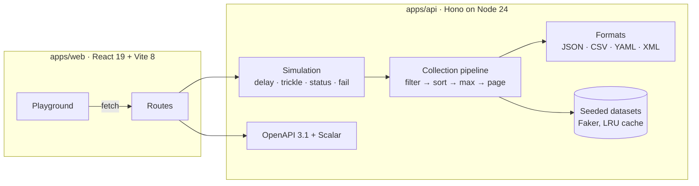

# REST in Pieces

[](https://github.com/spxis/rest-in-pieces/actions/workflows/ci.yml)
[](https://spxis.github.io/rest-in-pieces/)
[](https://www.npmjs.com/package/@johnmorrisdotca/rest-in-pieces)


[](LICENSE)

Seeded, realistic, localized data plus latency, error and messy-data drills, as a REST API, a function call or a patch on `fetch`.

**Try it: [spxis.github.io/rest-in-pieces](https://spxis.github.io/rest-in-pieces/).** The live demo runs the whole API inside the page, so there is no server behind it and nothing to install.

**A repeatable test backend for frontend development.** Build tables, pagination, sorting, filters, loading states, empty states and error handling against realistic data, before a real backend exists.

It plugs into [Vite, MSW, Storybook, Next.js, Playwright, Cypress and openapi-fetch](#use-with), and answers any origin.

[](https://spxis.github.io/rest-in-pieces/)

Every dataset is generated from a seed. The same URL returns the same records on every machine and after every restart, so a bug can be reproduced from its URL instead of disappearing with a new random dataset.

## Run it

**With npx**, with nothing to clone (Node.js 22.13 or later):

```sh
npx @johnmorrisdotca/rest-in-pieces                  # API, playground and docs on http://localhost:6800
npx @johnmorrisdotca/rest-in-pieces --port 6900      # another port; PORT works too
npx @johnmorrisdotca/rest-in-pieces --host 0.0.0.0   # reachable from other machines and containers
```

**With Docker:**

```sh
docker run --rm -p 6800:6800 ghcr.io/spxis/rest-in-pieces
```

**Inside your tests**, with no port and no server to start. `createApp()` builds the API and `app.request()` answers in-process, in Vitest, Jest, Playwright or any Node script:

```ts
import { createApp } from '@johnmorrisdotca/rest-in-pieces';
import { expect, test } from 'vitest';

test('lists five users', async () => {
  const res = await createApp().request('/users?limit=5&seed=42');
  expect(await res.json()).toHaveProperty('results.length', 5);
});
```

`@johnmorrisdotca/rest-in-pieces/core` exports `createApp` alone, with no Node imports, for workers and other fetch-style hosts.

### A backend inside the tab

`@johnmorrisdotca/rest-in-pieces/browser` runs the API inside the page, so a frontend on StackBlitz, CodeSandbox or any static host gets a REST backend with no server:

```js
import { installInBrowserApi } from '@johnmorrisdotca/rest-in-pieces/browser';

installInBrowserApi(); // answers fetch('/api/...') in this tab; every other request goes to the network

const { results } = await (await fetch('/api/users?limit=10&seed=7')).json();
```

`installInBrowserApi({ base: '/mock' })` moves it, and the function it returns puts the original `fetch` back. The API loads on the first request, so the page pays nothing for it until then. Only `fetch` is answered; libraries built on `XMLHttpRequest` still go to the network. To answer those too, use the [Mock Service Worker handlers](#mock-service-worker).

## Use with

### Vite

`@johnmorrisdotca/rest-in-pieces/vite` serves the whole API from the Vite dev server, under `/api` on the same origin as your app: one line, no second process, no proxy, no entry file. It applies to `vite dev` only, so nothing of it reaches a production build, and responses stream, so `?trickle=` arrives in pieces. `vite` is an optional peer dependency.

```ts
// vite.config.ts
import { defineConfig } from 'vite';
import { restInPieces } from '@johnmorrisdotca/rest-in-pieces/vite';

export default defineConfig({ plugins: [restInPieces()] }); // fetch('/api/users?limit=10') in the app
```

`restInPieces({ base: '/mock' })` moves it, and `app` passes options to `createApp()`. Every path outside the base stays Vite's. Because it runs in the dev server rather than the page, server-side rendering and any HTTP client work without a service worker.

Two other ways, neither needing the plugin:

- **[`@hono/vite-dev-server`](https://github.com/honojs/vite-plugins/tree/main/packages/dev-server)** runs a fetch-style app inside `vite dev` from an entry file. Prefer it when you are writing Hono routes of your own beside the fake ones, since it reloads the entry when it changes. Mount the API in the entry and leave every other path to Vite with `exclude`; its own `base` option moves Vite's base too, so it does not suit an app served at `/`.

  ```ts
  // src/api.ts
  import { Hono } from 'hono';
  import { createApp } from '@johnmorrisdotca/rest-in-pieces/core';
  export default new Hono().route('/api', createApp());

  // vite.config.ts: plugins: [devServer({ entry: 'src/api.ts', exclude: [/^\/(?!api(\/|\?|$))/] })]
  ```

- **Vite's `server.proxy`**, with no code at all: run `npx @johnmorrisdotca/rest-in-pieces` in another terminal and proxy to it. Prefer it when the same API should also answer curl, a phone on the network or another app.

  ```ts
  server: { proxy: { '/api': { target: 'http://localhost:6800', rewrite: (path) => path.replace(/^\/api/, '') } } }
  ```

### Mock Service Worker

`@johnmorrisdotca/rest-in-pieces/msw` gives [MSW](https://mswjs.io/) one handler that answers everything under a base path from the whole API. MSW's service worker catches `fetch`, `XMLHttpRequest` and axios alike, and a handler placed before it still wins, so a test can override one endpoint and leave the rest to the API. Pass MSW's own `http`: the entry imports nothing from `msw`, so it works with MSW 2 (`from 'msw'`) and MSW 3 (`from 'msw'` or `from 'msw/http'`). `msw` is an optional peer dependency.

**In the browser**, once the worker script is in place (`npx msw init public`):

```ts
import { http } from 'msw';
import { setupWorker } from 'msw/browser';
import { restInPiecesHandlers } from '@johnmorrisdotca/rest-in-pieces/msw';

await setupWorker(...restInPiecesHandlers({ http })).start({ onUnhandledRequest: 'bypass' }); // MSW 3: onUnhandledFrame
```

**In Vitest or Jest.** MSW in Node matches absolute URLs only, so give the base as one and point the code under test at it:

```ts
import { http } from 'msw';
import { setupServer } from 'msw/node';
import { restInPiecesHandlers } from '@johnmorrisdotca/rest-in-pieces/msw';

export const server = setupServer(...restInPiecesHandlers({ base: 'http://localhost/api', http }));
// beforeAll(() => server.listen()); afterEach(() => server.resetHandlers()); afterAll(() => server.close());
```

`server.use(http.get('http://localhost/api/users', () => HttpResponse.json({ results: [] })))` overrides one endpoint for one test; every other request under the base still reaches the API.

**With MSW 3's Vite plugin**, which serves the worker and leaves it out of production builds (`plugins: [msw()]` from `msw/vite` in `vite.config.ts`):

```ts
if (import.meta.env.DEV) {
  const { network } = await import('virtual:msw');
  const { http } = await import('msw/http');
  const { restInPiecesHandlers } = await import('@johnmorrisdotca/rest-in-pieces/msw');
  network.configure({ handlers: restInPiecesHandlers({ http }) });
  await network.enable();
}
```

`restInPiecesHandlers({ base, app, http })` takes the same `base` (default `/api`) and `app` options as `installInBrowserApi`, and loads the API on the first request it matches.

### Storybook

With [msw-storybook-addon](https://github.com/mswjs/msw-storybook-addon), start the worker with the handlers once in `.storybook/preview.ts`. Handlers given to `setupWorker` survive the addon's reset between stories:

```ts
import { http } from 'msw';
import { setupWorker } from 'msw/browser';
import { mswLoader } from 'msw-storybook-addon/csf3'; // CSF Next: addons: [addonMsw(start)]
import { restInPiecesHandlers } from '@johnmorrisdotca/rest-in-pieces/msw';

const start = async () => {
  const worker = setupWorker(...restInPiecesHandlers({ http }));
  await worker.start({ onUnhandledRequest: 'bypass' });
  return worker;
};
export default { loaders: [mswLoader(start)] };
```

The loading, error and overflow stories then need no mocking code, only another URL:

```ts
export const Loading = { args: { src: '/api/users?delay=3000' } };
export const Failed = { args: { src: '/api/users?status=500' } };
export const Messy = { args: { src: '/api/users?messy=true&seed=3' } };
```

### Next.js

A catch-all route handler hosts the whole API inside a Next.js app, on its own origin. Hono's `mount` takes the base off the path before the API sees it (`hono` is already a dependency of this package; add it to yours if your package manager is strict):

```ts
// app/api/[[...path]]/route.ts
import { Hono } from 'hono';
import { createApp } from '@johnmorrisdotca/rest-in-pieces/core';

const app = new Hono().mount('/api', createApp().fetch);
const handler = (request: Request) => app.fetch(request);
export { handler as GET, handler as HEAD, handler as POST, handler as PUT, handler as PATCH, handler as DELETE, handler as OPTIONS };
```

The same `createApp().fetch` runs on any other fetch-style host: Cloudflare Workers, Deno, Bun or a Vercel function.

### Playwright

No server and no MSW: answer the page's API requests from the app in the test process with `page.route`, so each test gets the same data and can turn on a drill by URL:

```ts
import { createApp } from '@johnmorrisdotca/rest-in-pieces';

const app = createApp();
test.beforeEach(({ page }) => page.route('**/api/**', async (route) => {
  const request = route.request();
  const url = new URL(request.url());
  const response = await app.request(url.pathname.replace(/^\/api/, '') + url.search, { method: request.method(), headers: request.headers(), body: request.postDataBuffer() });
  await route.fulfill({ status: response.status, headers: Object.fromEntries(response.headers), body: Buffer.from(await response.arrayBuffer()) });
}));
```

Or start the API beside your app with Playwright's `webServer` (`command: 'npx @johnmorrisdotca/rest-in-pieces --port 6800'`, `url: 'http://localhost:6800/health'`).

[`@msw/playwright`](https://github.com/mswjs/playwright) (MSW 3) does the same through MSW, so the [MSW handlers](#mock-service-worker) plug straight in. Give them the base at your app's origin:

```ts
import { defineNetworkFixture } from '@msw/playwright';

const handlers = restInPiecesHandlers({ base: 'http://localhost:5173/api', http });
// in test.extend: const network = defineNetworkFixture({ context, handlers }); await network.enable(); await use(network); await network.disable();
```

### Cypress

Cypress runs its intercept handlers in the browser, so the API runs as a server beside your app. With [start-server-and-test](https://github.com/bahmutov/start-server-and-test) and the package installed as a dev dependency:

```json
"scripts": {
  "api": "rest-in-pieces --port 6800",
  "e2e": "start-test api http://localhost:6800/health dev http://localhost:5173 'cypress run'"
}
```

Slow, failing and flaky answers come from the API's own `?delay=`, `?status=` and `?fail=`, with no mocking code in the test. Keep `cy.intercept` for the faults no server can make, such as a dropped connection: `cy.intercept('GET', '/api/users*', { forceNetworkError: true })`. Or call `installInBrowserApi()` in the app under test and need no server at all.

### Typed clients

The package ships the API's OpenAPI 3.1 document as `@johnmorrisdotca/rest-in-pieces/openapi.json`, and TypeScript types for every path and schema, generated from it by [openapi-typescript](https://openapi-ts.dev/), as `@johnmorrisdotca/rest-in-pieces/types`. They describe the version installed, with nothing running. With [openapi-fetch](https://openapi-ts.dev/openapi-fetch/):

```ts
import createClient from 'openapi-fetch';
import type { paths } from '@johnmorrisdotca/rest-in-pieces/types';

const api = createClient<paths, 'application/json'>({ baseUrl: 'http://localhost:6800' });
const { data } = await api.GET('/users', { params: { query: { limit: '10', seed: '42' } } });
if (data && !Array.isArray(data)) console.log(data.metadata.total, data.results[0]?.email); // metadata=false returns a bare array
```

`components['schemas']['User']`, `['Person']`, `['Product']` and the rest type single records, and `['UserInput']` and its siblings the write bodies. Query parameters are strings, as they are in a URL. To generate the types yourself, point openapi-typescript at the document: `npx openapi-typescript node_modules/@johnmorrisdotca/rest-in-pieces/dist/openapi.json -o rest-in-pieces.d.ts`, or at `/openapi.json` on any running instance.

### Any origin

CORS is on by default, so a frontend on any dev-server origin can call the API directly. Every response carries `Access-Control-Allow-Origin: *`; a preflight `OPTIONS` answers `204` with the methods allowed and the requested headers echoed back, so a write with an `Authorization` header preflights too; and `X-Total-Count`, `Link`, `ETag`, `X-Simulated`, `Retry-After` and `Location` are exposed to scripts.

## Why use it

- **Repeatable data.** `?seed=42` always returns the same records. Screenshots, snapshot tests and bug reports stay stable.
- **Realistic collections.** People, users, products, companies and countries, plus any shape you describe with 239 generator types.
- **Fifteen countries, and a global mix.** `?locale=de`, `?locale=pt-BR` or `?locale=ko` writes every dataset for that country: native names, addresses, postal codes and phone numbers, and prices in the local currency. `?locale=global` mixes them record by record, the way a real international user table looks, and still repeats per seed. See [Data locales](#data-locales).
- **Hand-built Japanese data.** `?locale=ja` gives kanji names with katakana readings, real prefectures and cities, 〒 postal codes, mobile numbers, yen prices and Japanese country names.
- **Everything a list screen needs.** Paging, sorting, field filters with ranges, free-text search, `X-Total-Count` and `Link` headers, and ETags.
- **The unhappy path on demand.** `?delay=1500`, `?status=503` or `?fail=0.2` rehearse slow, failing and flaky backends without touching your client.
- **Any format.** JSON, CSV, YAML or XML, chosen by `?format=` or the `Accept` header.
- **Self-documenting.** An OpenAPI 3.1 spec generated from the same schemas that validate requests, with interactive docs at `/docs`.
- **A playground in English and 日本語.** Build a request, inspect the table, body and headers, page through results, and share the exact setup as a link. The language follows the browser, `?lang=ja` or the toggle in the top bar.

## How it compares

Most tools in this space either intercept requests and leave you to write the data, or serve data you wrote by hand and leave you to write the realism. REST in Pieces ships the data and the unhappy paths, and runs behind most of the interception tools.

| Tool | What it is | Verdict |
| ---- | ---------- | ------- |
| [json-server](https://github.com/typicode/json-server) | A REST API over a `db.json` you write | Closest in spirit. It has persisted writes and relations today, which REST in Pieces does not (its writes are stateless); REST in Pieces has generated, seeded, localized data, paging, formats and failure drills with nothing to write. |
| [MSW](https://mswjs.io/) | Request interception in the browser and Node | Not a rival but a host: MSW intercepts, REST in Pieces answers. Use the [MSW handlers](#mock-service-worker). |
| [Mirage JS](https://miragejs.com/) | A fake server in the tab, with models and factories you define | Mirage wants a schema and routes; REST in Pieces needs no setup, but has no in-memory database. |
| [Prism](https://github.com/stoplightio/prism) | A mock server generated from your OpenAPI file | Use Prism when you have a contract to mock; use REST in Pieces when you do not, and want realistic data rather than examples. |
| [Mockoon](https://mockoon.com/) | A desktop app and CLI for hand-templated mock routes | Better for people who prefer a GUI and per-route templates; REST in Pieces is code-first, with seeds and locales built in. |
| [DummyJSON](https://dummyjson.com/), [JSONPlaceholder](https://jsonplaceholder.typicode.com/) | Hosted fake APIs at public URLs | Nothing to install, but fixed English data and no failure drills; DummyJSON also has login and tokens, which REST in Pieces does not. The [fixtures](#fixtures) and the live demo are the hosted side here. |
| [Faker](https://fakerjs.dev/) | A library of generators you call in code | REST in Pieces is built on it, and serves it over HTTP with paging, filters, formats and seeds already done. |

## Quick start

Requires Node.js 22.18 or later (24 LTS recommended) and pnpm.

```sh
pnpm install
pnpm dev
```

| Service    | URL                                                  |
| ---------- | ---------------------------------------------------- |
| API        | [http://localhost:6800](http://localhost:6800)       |
| API docs   | [http://localhost:6800/docs](http://localhost:6800/docs) |
| Playground | [http://localhost:6801](http://localhost:6801)       |

Or run everything from one container, with nothing to install but Docker:

```sh
docker run --rm -p 6800:6800 ghcr.io/spxis/rest-in-pieces   # playground, API and docs on :6800
```

To build the image from your checkout instead:

```sh
docker build -t rest-in-pieces .
docker run --rm -p 6800:6800 rest-in-pieces   # playground, API and docs on :6800
```

## Using the API

```sh
# First page of people, in the original envelope
curl 'http://localhost:6800/names?limit=10'

# Women in their thirties in Ontario, oldest first
curl 'http://localhost:6800/names?gender=female&age[gte]=30&age[lt]=40&province=Ontario&sortBy=age:numeric&sortDirection=desc'

# Page by page number, or follow a cursor from metadata.nextCursor
curl 'http://localhost:6800/users?page=3&pageSize=20'
curl 'http://localhost:6800/users?limit=20&cursor='

# One record
curl 'http://localhost:6800/users/42?seed=7'

# Books under $100 as CSV
curl 'http://localhost:6800/products?department=Books&price[lt]=100&format=csv'

# The same people, for a Japanese audience
curl 'http://localhost:6800/names?locale=ja&province=東京都&limit=5'

# An international user table: every row from its own country
curl 'http://localhost:6800/users?locale=global&limit=20'

# Your own shape
curl 'http://localhost:6800/generate?fields=name:person.fullName,email:internet.email,plan:commerce.productAdjective&seed=3'
curl -X POST 'http://localhost:6800/generate?limit=5' \
  -H 'Content-Type: application/json' \
  -d '{ "fields": { "sku": "string.uuid", "price": "commerce.price" }, "count": 200, "seed": 9 }'

# Data that breaks layouts: nulls, 2,000-character descriptions, emoji, Arabic, edge numbers and dates
curl 'http://localhost:6800/products?messy=true&seed=1'

# A flaky backend: 30% of requests fail
curl -i 'http://localhost:6800/users?fail=0.3'

# Uneven latency, then a body that arrives in pieces 200 ms apart
curl -N 'http://localhost:6800/users?delay=200-800&trickle=200'
```

### Endpoints

| Endpoint                   | Description |
| -------------------------- | ----------- |
| `GET /names`               | People: name, age, address, city, province, postal code, country, gender, written for the `locale` (Canadian by default). The original dataset, also at `/random-names`. |
| `GET /users`               | Application users with profile, avatar, contact details and account status. |
| `GET /products`            | Catalogue products with SKU, department, price in the locale's currency (`currency` is ISO 4217), rating and stock. |
| `GET /companies`           | Companies with industry, website, size, founding year and location. |
| `GET /countries`           | Every country and territory with ISO codes, currencies, languages and calling codes. |
| `GET /{dataset}/{id}`      | One record: `/names/0`, `/users/1`, `/countries/CA` or `/countries/CAN`. |
| `POST /{dataset}`          | Validates a new record and answers `201` with it, as it would have been created. See [Writes](#writes). |
| `PUT`, `PATCH`, `DELETE /{dataset}/{id}` | Replace, update or delete a record: `200` with the result, or `204` for a delete. Nothing is stored. |
| `GET /generate`            | Records from a field list, e.g. `fields=name:person.fullName,email:internet.email`. |
| `POST /generate`           | The same, with the fields, `count` and `seed` in a JSON body. |
| `GET /generators`          | Every generator type, flat and grouped by module. |
| `GET /resources`           | The datasets and their fields, per locale. |
| `GET /locales`             | The data locales, with their names, BCP 47 tag, country and currency. |
| `GET /health`              | Status, version and uptime. |
| `GET /docs`, `/openapi.json` | Interactive reference and the OpenAPI 3.1 document. |

### Query parameters

These work on every collection, including `/generate`.

| Parameter       | Default   | Description |
| --------------- | --------- | ----------- |
| `limit`         | `10`      | Records per page, up to 1000. Aliases: `size`, `length`, `pageSize`. |
| `offset`        | `0`       | Records to skip. |
| `page`          | none      | One-based page number in pages of `limit`: `page=3&pageSize=20` is `offset=40&limit=20`. |
| `cursor`        | none      | An opaque cursor from `metadata.nextCursor` or `prevCursor`. Takes precedence over `page` and `offset`; an empty `cursor=` starts on the first page. A cursor used with different filters, sort, `q`, `seed`, `locale`, `messy` or `max` returns `400`. |
| `max`           | `1000`    | Caps the dataset, to test the last page and end-of-data handling. Alias: `maxRecords`. |
| `sortBy`        | none      | Field to sort by. Append `:numeric` to compare as numbers, e.g. `age:numeric`. |
| `sortDirection` | `asc`     | `desc` (also `descending`, `reverse`, `rev`, `backwards`, `-1`). Alias: `sortOrder`. |
| `q`             | none      | Case-insensitive search across every field. |
| *field name*    | none      | Filters: `gender=female`, `province=Ontario,Quebec`, `age[gte]=30`. Operators: `eq`, `ne`, `gt`, `gte`, `lt`, `lte`. |
| `seed`          | `1`       | Selects a repeatable dataset. |
| `locale`        | `en-CA`   | Which country the data is written for, or `global` for a mix. See [Data locales](#data-locales). |
| `messy`         | off       | Rewrites a share of values into the ones that break layouts: null and missing keys, empty and whitespace-only strings, very long strings (120 characters, 2,000 for descriptions), emoji, combining marks and zero-width joiners, right-to-left text, leading and trailing whitespace, edge numbers (0, negative, very large, many decimals) and edge dates (the epoch, the far future, 29 February). `true` rewrites about 15%; `0.5` sets the share. The same `seed` gives the same mess, so a bug can be shared by URL. Values keep their type, but any field except the id may be null or missing. Also on `/{dataset}/{id}`. |
| `metadata`      | on        | `false` returns the bare array. `/countries` defaults to off for compatibility. |
| `resultsName`   | `results` | Renames the results key, e.g. `rows`. |
| `format`        | `json`    | `csv`, `yaml` or `xml`. The `Accept` header works too. |
| `delay`         | `0`       | Milliseconds to wait before responding, up to 10000. A range such as `200-800` picks a wait inside it from the request, seed included, so the same URL waits the same time on every machine. |
| `trickle`       | `0`       | Sends the headers at once and the body in pieces this many milliseconds apart, in any format, so time to first byte and total time can be told apart. With `delay`, the response still takes no more than 10 s. |
| `status`        | none      | Respond with this status. 4xx and 5xx return a simulated error; 2xx and 3xx override the success status. |
| `fail`          | off       | `true` fails the request with a 500 (or `status`); a fraction such as `0.2` fails that share of requests. |

Simulated responses carry `X-Simulated: true`, and 429 and 503 carry `Retry-After`. Simulation never applies to `/health` or the docs.

### Response shape

```json
{
  "metadata": {
    "count": 10,
    "total": 1000,
    "timestamp": "1790618113511",
    "lastUpdated": "2026-09-28T17:55:13.511Z",
    "output": { "results": "results" },
    "version": "2.1.0",
    "parameters": { "size": 10, "offset": 0, "max": 1000, "seed": 1, "locale": "en-CA", "q": null, "sortBy": null, "sortType": "string", "sortDirection": "asc" },
    "links": { "self": "/names?limit=10&offset=0", "first": "…", "last": "…", "prev": null, "next": "/names?limit=10&offset=10" },
    "nextCursor": "MS4xMC4xbWpzZnBiM3JmaQ",
    "prevCursor": null
  },
  "results": [{ "index": 0, "name": "Aaliyah Corkery", "age": 26, "…": "…" }]
}
```

`total` counts the records after filters and `max`. The same numbers are in the `X-Total-Count` and `Link` headers, which are exposed to browsers through CORS.

`links` and the `Link` header page the way the request did: with `offset` and `limit`, with `page` and `pageSize`, or with `cursor`. `nextCursor` is null on the last page and `prevCursor` on the first.

### Writes

`/names`, `/users`, `/products` and `/companies` take writes, so a client can rehearse a form submit, an optimistic update, a delete confirmation and a validation error:

```sh
# Create: 201, with the next id after the dataset's last, createdAt, updatedAt and a Location header
curl -i -X POST 'http://localhost:6800/users' -H 'Content-Type: application/json' \
  -d '{ "firstName": "Ada", "lastName": "Lovelace", "username": "ada", "email": "ada@example.com",
        "avatar": "https://example.com/ada.png", "phone": "416-555-0100", "jobTitle": "Analyst",
        "company": "Analytical Engines", "city": "Toronto", "country": "CA", "active": true }'

# Update some fields: 200 with the record merged with them
curl -X PATCH 'http://localhost:6800/users/42' -H 'Content-Type: application/json' -d '{ "active": false }'

# Delete: 204
curl -i -X DELETE 'http://localhost:6800/users/42'

# A validation error, a conflict, and a slow failing save
curl -X POST 'http://localhost:6800/users' -H 'Content-Type: application/json' -d '{ "email": "nope" }'
curl -i -X PUT 'http://localhost:6800/users/42?conflict=true' -H 'Content-Type: application/json' -d '{ … }'
curl -i -X PATCH 'http://localhost:6800/users/42?delay=1500&status=503' -H 'Content-Type: application/json' -d '{}'
```

| Request | Answer |
| ------- | ------ |
| `POST /{dataset}` | `201` with the record, the next id (`1001` for users, `1000` for the zero-based `/names`), `createdAt` and `updatedAt`, and `Location: /users/1001`. |
| `PUT /{dataset}/{id}` | `200` with the body under the same id, `createdAt` kept and `updatedAt` set. Every field is required. |
| `PATCH /{dataset}/{id}` | `200` with the record merged with the fields sent, and `updatedAt` set. |
| `DELETE /{dataset}/{id}` | `204` with no body. |
| An unknown id | `404`, as the `GET` answers. |
| A body that fails validation | `422` with a message per field: `{ "error": "Validation failed", "fields": { "email": "Invalid email" } }`. A missing field says `Required`. |
| `?conflict=true` | `409`, to rehearse "someone else changed this". |
| Malformed JSON, or no `Content-Type: application/json` | `400` or `415`. Bodies over 64 KB get `413`. |

The body is the record without the fields the server sets (the id and `createdAt`); those are ignored if sent, and so is any field the dataset does not have. The schemas are `PersonInput`, `UserInput`, `ProductInput` and `CompanyInput` in [`/openapi.json`](#endpoints). Every record a dataset serves is a valid `PUT` body. `delay`, `trickle`, `status` and `fail` work as they do on reads; on a `PUT`, `PATCH` or `DELETE`, `seed` and `locale` choose the record, as on the `GET`. Writes answer in JSON.

**Stateless by design.** Nothing is stored: a write never changes what a later read returns, on a shared host or anywhere else. The response is what the write would have produced. This is a rehearsal backend, not a store. `/countries` is real reference data keyed by ISO code, so it stays read-only, as does the deprecated `/random-names` alias.

## Data locales

Add `locale` to any dataset, item route or `/generate` call. `GET /locales` lists the same table.

| `locale` | Data for | `country` | `currency` |
| -------- | -------- | --------- | ---------- |
| `en-CA` | English (Canada), the default | `CA` | `CAD` |
| `en-US` | English (United States) | `US` | `USD` |
| `en-IN` | English (India) | `IN` | `INR` |
| `zh-CN` | Chinese (China) | `CN` | `CNY` |
| `pt-BR` | Portuguese (Brazil) | `BR` | `BRL` |
| `en-GB` | English (United Kingdom) | `GB` | `GBP` |
| `ru` | Russian (Russia) | `RU` | `RUB` |
| `de` | German (Germany) | `DE` | `EUR` |
| `id` | Indonesian (Indonesia) | `ID` | `IDR` |
| `ja` | Japanese (Japan), hand-built | `JP` | `JPY` |
| `fr` | French (France) | `FR` | `EUR` |
| `fr-CA` | French (Canada) | `CA` | `CAD` |
| `ko` | Korean (South Korea) | `KR` | `KRW` |
| `es-MX` | Spanish (Mexico) | `MX` | `MXN` |
| `vi` | Vietnamese (Vietnam) | `VN` | `VND` |
| `global` | A mix of all of the above | each record's own | each product's own |

- **Same shape everywhere.** Field names never change with the locale: `province` holds a state, prefecture or region and `postal` a ZIP, PIN or postcode. `country` (ISO 3166-1 alpha-2) on every person, user and company tells a client how to read them, and `currency` on every product says what `price` is in.
- **`global` is a mix, not a blend.** Each record's locale is chosen from the seed, weighted roughly by each country's developer population, so the US, India and China turn up most and the smaller locales less often. A table then holds 古谷 あゆみ, Нонна Журавлева and a German street address side by side, which is where layout bugs live. The same seed always gives the same mix. Japanese records keep their `nameKana` and `nameRomaji`; other records don't have them. Responses for the mix carry no `Content-Language`.
- **Spellings.** `en_US`, `pt-br` and full tags such as `ja-JP` or `de-DE` work too. Anything else is a 400 that lists the choices.
- **Custom data.** `/generate` draws every field from the record's locale. Two extra types, `locale.country` and `locale.currency`, put the record's country and currency in a field, which says where each row of a `global` schema came from. A type the locale has no data for (Russian has no name prefixes) comes back `null`.
- **Country names.** `/countries` names countries in the locale's language from the runtime's CLDR data; English locales and `global` keep the English names.
- **Where Faker falls back.** Every locale but Japanese comes from Faker, which falls back to US English without saying so where a locale lacks data. Canadian and British names and Canadian streets are its US English lists, and Vietnamese streets use English street types (`Toàn Thắng Plain`). Product names, job titles and slogans are English in several locales. `apps/api/test/locales.test.ts` records each of these, so a Faker upgrade that changes one fails a test instead of passing unnoticed.

## Japanese data

Add `locale=ja` to any dataset, item route or `/generate` call. Records keep the same shape and field names, so a client can switch locales without code changes. Japanese records add readings where Japanese forms ask for them.

| Dataset      | What changes with `locale=ja` |
| ------------ | ----------------------------- |
| `/names`     | Family name first (`佐藤 美穂`), plus `nameKana` (`サトウ ミホ`) and `nameRomaji` (`Sato Miho`). Prefectures and real cities, weighted by population, and `123-4567` postal codes. |
| `/users`     | Kanji names with `firstNameKana` and `lastNameKana`, romaji usernames and emails, mobile numbers (`090-1234-5678`) and Japanese job titles. |
| `/products`  | Japanese products and departments, priced in whole yen the way shops write them (`1980`, `2000`), with `currency: "JPY"`. |
| `/companies` | `株式会社` names, industries, slogans, romaji domains and real area codes such as `03` for Tokyo and `06` for Osaka. |
| `/countries` | Country names in Japanese (`カナダ`, `日本`) from the runtime's CLDR data. |
| `/generate`  | Every generator uses Faker's Japanese locale. |

Filters and search work on Japanese text: `/names?locale=ja&province=東京都`. Responses carry `Content-Language`, and `metadata.parameters.locale` records the choice. `gender` stays `male` or `female` in every locale so filters are portable.

### 日本語データ

任意のエンドポイントに `locale=ja` を付けると、日本向けのデータを返します。氏名は姓・名の順で、フリガナ（`nameKana`）とローマ字（`nameRomaji`）付きです。住所は実在の都道府県・市区町村を使用し、郵便番号は `123-4567` 形式、電話番号は `090-1234-5678` 形式、商品の価格は円単位（`1980` や `2000` など）です。同じ `seed` なら、いつでも同じデータが返ります。

```sh
curl 'http://localhost:6800/users?locale=ja&limit=5'
curl 'http://localhost:6800/products?locale=ja&sortBy=price:numeric&format=csv'
```

## Fixtures

The live demo also serves every dataset as static files, written by the API when the site is built, so a plain URL works from `curl`, a `<script>`, a tutorial or a test, with CORS and no server behind it:

```sh
curl https://spxis.github.io/rest-in-pieces/fixtures/users.json             # 1,000 users, seed 1, en-CA
curl https://spxis.github.io/rest-in-pieces/fixtures/ja/products.page-1.csv  # the first 10 Japanese products, as CSV
curl https://spxis.github.io/rest-in-pieces/fixtures/global/names/0.json    # one person from the global mix
```

- **What is there.** Every dataset at seed 1, in every locale and `global`: all its records (`users.json`, `users.csv`: 1,000 records, or every country for `countries`), the first page of 10 (`users.page-1.json`, `users.page-1.csv`), and its first three records in item form (`users/1.json`).
- **Where.** The default locale, `en-CA`, sits at the top of the folder, as it does in the API; every other locale has a folder of its own: `de/users.json`, `global/users.json`.
- **Exactly the API's response.** Each file is what the API returns for the request it names: `users.page-1.json` is `/users?seed=1&locale=en-CA&limit=10`. The `metadata.links` in a JSON list are the API's own paths, which need a running API.
- **Discoverable.** [`fixtures/index.json`](https://spxis.github.io/rest-in-pieces/fixtures/index.json) lists every file with its `url`, size in `bytes`, `contentType`, `dataset`, `locale`, `format`, `kind` (`all`, `page` or `item`) and the `request` it answers.
- **Size.** About 560 files and 31 MB, before Pages compresses them. They are rebuilt with every deploy and never committed. For another seed, a filter or another format, use the API.

## Architecture



- **One pipeline.** Every collection, built-in or generated, goes through the same filter, sort, cap and page steps, so behaviour is identical everywhere.
- **Schemas first.** Routes are declared with Zod through `@hono/zod-openapi`; the OpenAPI document is generated from them and cannot drift from the code.
- **Deterministic by construction.** Datasets depend only on their seed, and the most recently used ones are cached in memory.
- **No build step for the API.** Node runs the TypeScript directly with type stripping.
- **Runs anywhere fetch does.** `createApp()` in `apps/api/src/core.ts` uses only web standards. `app.ts` adds the Node parts (logging and static files), and the GitHub Pages build loads the same app into the browser tab.

```
apps/api     Hono API: routes, collection pipeline, datasets, OpenAPI
apps/web     React playground: components, hooks, request builder
tests/e2e    Playwright tests that drive the playground against the real API
```

## Development

| Script               | What it does |
| -------------------- | ------------ |
| `pnpm dev`           | API on :6800 and playground on :6801, both reloading |
| `pnpm check`         | Lint, typecheck, unit tests and build |
| `pnpm test`          | Unit and component tests (Vitest) |
| `pnpm test:coverage` | API tests with coverage thresholds |
| `pnpm test:e2e`      | Playwright end-to-end tests |
| `pnpm format`        | Apply formatting and safe lint fixes (Biome) |
| `pnpm release <version>` | Set the version, date the changelog, commit and tag; see [Releasing](CONTRIBUTING.md#releasing) |

Set `PORT` to move the API, and `VITE_API_BASE_URL` to point the playground elsewhere. See [CONTRIBUTING.md](CONTRIBUTING.md) for the full workflow.

## Deploying

**Vercel.** Create one project with **Root Directory** `apps/api`. `apps/api/vercel.json` builds the playground into `public/`, so the playground, API and docs share one origin with no extra configuration.

**Docker.** Every release publishes `ghcr.io/spxis/rest-in-pieces` for amd64 and arm64, tagged with its version (such as `:2.2.0`) and `latest`. The image serves everything from port 6800, runs as a non-root user and includes a health check.

**GitHub Pages.** `.github/workflows/pages.yml` publishes the in-browser playground on every push to `main`. `pnpm --filter @rest-in-pieces/web build:pages` builds it locally into `apps/web/dist-pages`: the playground, the API bundled as a chunk it loads on the first request, static copies of `api/openapi.json` and `api/docs/`, and the [fixtures](#fixtures). Set `PAGES_BASE` to serve it from somewhere other than `/rest-in-pieces/`. [CONTRIBUTING.md](CONTRIBUTING.md#previewing-the-github-pages-build) shows how to preview it locally.

## License

MIT © 2014–2026 John Morris. Security issues: see [SECURITY.md](SECURITY.md).
